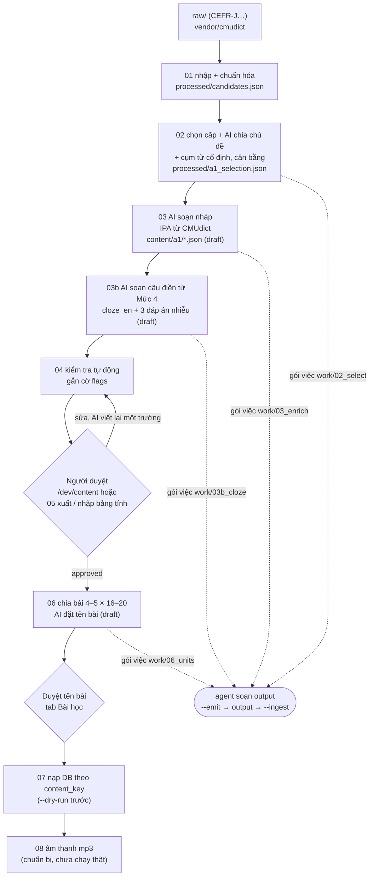

# README.md

Quy trình xây kho từ, chạy lại được nhiều lần và dùng nguyên vẹn cho A1…C2. AI chỉ soạn **bản nháp**, máy kiểm tra tự động,
người duyệt, rồi mới nạp vào DB. **Mặc định không tốn phí API:** "AI" là agent đang code (Claude Code) tự soạn output cho các
gói việc trong phiên làm việc (chế độ agent). **Nội dung là code:** nguồn chính là `backend/content/<cấp>/<mã-chủ-đề>.json` (đưa lên Git),
và DB chỉ được nạp từ các file này.

## Chuẩn bị

- Nguồn: đặt file vào `raw/` (không đưa lên Git) và ghi đủ giấy phép ở `docs/data-sources.md`. File không có bộ đọc thì
  bước 01 dừng. Thêm nguồn mới: viết một module trong `lib/sources/` (kiểu plugin), không sửa các bước. Hiện có: CEFR-J
  Vocabulary Profile 1.5 (`raw/cefrj-vocabulary-profile-1.5.csv`).
- AI: `AI_PROVIDER` (biến môi trường hoặc `backend/.env`):
  - `agent` (**mặc định, cách chính**): không gọi API, không cần key, không in chi phí. Xem mục "Chế độ agent".
  - `anthropic` (chỉ khi đặt rõ): cần `ANTHROPIC_API_KEY`, `ANTHROPIC_MODEL` trong `backend/.env` (không commit, không log);
    thiếu key thì báo lỗi rõ. Chỉ provider này in ước tính chi phí và hỏi xác nhận (`--yes` bỏ hỏi); trần
    `MAX_AI_ENTRIES_PER_RUN`, giá ước tính `AI_PRICE_INPUT_PER_MTOK` / `AI_PRICE_OUTPUT_PER_MTOK`.
- Mọi lệnh chạy trong `backend/`, với `.venv` đã kích hoạt.

## Chế độ agent (cách chính)

Các bước có AI (02 phân loại chủ đề, 03 soạn nháp, 03b câu điền từ, 06 đặt tên bài, viết lại một trường) đi đúng đường của provider API, chỉ
thay lệnh gọi mạng bằng **gói việc**:

1. `--emit`: mỗi request chưa có trong cache thành `work/<bước>/batch_<số>.input.json`: mục cần xử lý, `output_schema` (JSON
   schema sinh từ model Pydantic), `style_guide_rules` (nguyên khối quy tắc của `docs/content-style-guide.md`), `system_prompt`
   và `user_message` như gửi API, cùng chỉ dẫn.
2. Agent đọc gói, soạn `work/<bước>/batch_<số>.output.json` (CHỈ JSON đúng schema). IPA không cần soạn: luôn lấy từ CMUdict,
   chỉ mục ghi `"ipa": "missing"` mới đề xuất.
3. `--ingest`: kiểm output bằng đúng model Pydantic; sai → `work/<bước>/rejected.json` (sửa output rồi `--ingest` lại); đúng →
   ghi cache và kết quả (nội dung `status = draft`) y như provider API. Mục output còn thiếu, hoặc giai đoạn sau của bước 02
   (cụm từ, đề xuất thêm), thành gói mới ngay trong lần ingest đó.
4. `python -m data_pipeline.pipeline status`: số gói đã emit / có output / đã ingest của từng bước, gói sai schema, việc phải làm
   tiếp, tiến độ nội dung theo chủ đề ("x/10 chủ đề đã soạn đủ") và hàng đợi viết lại. Bị ngắt giữa chừng thì chạy lệnh này để
   biết làm tiếp từ đâu.

`work/` nằm trong `.gitignore`; chỉ commit `content/**/*.json`. Lần `--ingest` không ghi phạm vi (`--topic`, `--per-topic`,
`--limit`) thì dùng phạm vi của lần `--emit` gần nhất.

Soạn theo lô chủ đề (khoảng 80 mục): `03_enrich_entries --level A1 --topic food --emit`, soạn output, `--ingest`, chạy
`04_validate`, rồi sang chủ đề tiếp.

**Viết lại một trường:** ở `/dev/content` bấm "Gửi yêu cầu viết lại" (kèm ghi chú) → `work/rewrite_queue.json`, mục hiện "Đang
chờ viết lại". Khi người duyệt nói "xử lý hàng đợi viết lại": `python -m data_pipeline.pipeline rewrite --emit`, agent soạn
output trong `work/rewrite/`, `… rewrite --ingest`; trang duyệt hiện bản cũ và bản mới cạnh nhau để chọn (chọn bản mới mới ghi
file).

## Lệnh từng bước

| Bước | Lệnh | Ghi chú |
|---|---|---|
| 01 | `python -m data_pipeline.01_import_wordlist` | In số dòng mỗi nguồn, số trùng, số bị loại kèm lý do |
| 02 | `python -m data_pipeline.02_select_and_tag --level A1 [--limit 40] --emit` rồi `--ingest` (lặp tới khi hết gói) | Gói 40 từ; gửi kèm gợi ý chủ đề của CEFR-J. Còn gói chờ thì chưa ghi selection. `--limit`: chạy thử, không thêm cụm từ / cân bằng |
| 03 | `python -m data_pipeline.03_enrich_entries --level A1 [--topic food …] [--per-topic 10] [--limit 40] [--redo-drafts] --emit` rồi `--ingest` | Gói 15 mục cùng chủ đề; lỗi → `processed/failed_03.json` |
| 03b | `python -m data_pipeline.03b_cloze --level A1 [--topic food …] [--limit 40] [--redo] --emit` rồi `--ingest` | Câu Mức 4 `cloze_en` (chỉ đúng 1 đáp án hợp) + đúng 3 `cloze_distractors` cùng từ loại cho mục draft chưa có câu; gói 15 mục kèm kho từ của cấp theo từ loại; output có `why_wrong` (tự kiểm từng đáp án nhiễu, không lưu). Quy tắc: `docs/content-style-guide.md` mục 7b |
| 04 | `python -m data_pipeline.04_validate --level A1` | Không gọi AI; báo cáo `processed/report_04.json` |
| duyệt | Mở `/dev/content` (backend `ENV=development`, frontend `npm run dev`) | Phím A duyệt · R từ chối (bắt buộc lý do) · S bỏ qua · J mục sau · K mục trước (quy ước Gmail / Vim); tab Bài học |
| 05 | `python -m data_pipeline.05_review_export export --level A1 --out reviewed/a1.xlsx` rồi `import --file … [--apply]` | Tùy chọn: duyệt bằng bảng tính, xem trước khác biệt trước khi ghi |
| 06 | `python -m data_pipeline.06_build_units --level A1 [--topic food] --emit` rồi `--ingest` | Chỉ mục approved; tên bài đề xuất ở trạng thái draft |
| 07 | `python -m data_pipeline.07_load_to_db --level A1 --dry-run`, rồi bỏ `--dry-run` | Production: chạy `sh scripts/backup_db.sh` trước và thêm `--yes` |
| 08 | `python -m data_pipeline.08_generate_audio --level A1 --provider fake [--dry-run]` | Chưa có nhà cung cấp TTS thật |
| CI | `python -m data_pipeline.check_content` | Kiểm tra schema mọi `content/**/*.json` |
| mẫu duyệt | `python -m data_pipeline.pipeline sample --level A1 --per-topic 10 [--seed N] [--force]` | Chọn ngẫu nhiên N mục mỗi chủ đề (hạt giống ghi vào `work/review_sample_a1.json`) để duyệt kỹ trước; DỪNG nếu còn mục draft chưa có câu điền từ Mức 4 (chạy 03b trước). `/dev/content` có bộ lọc "Mẫu duyệt"; `pipeline status` hiện tiến độ mẫu |
| tình trạng | `python -m data_pipeline.pipeline status [--level A1]` | Gói việc từng bước + tiến độ nội dung + hàng đợi viết lại |
| viết lại | `python -m data_pipeline.pipeline rewrite --emit` / `--ingest` | Hàng đợi "viết lại một trường" từ `/dev/content` |

AI_PROVIDER=anthropic: bỏ `--emit` / `--ingest` (thêm `--yes` để không hỏi xác nhận chi phí).

Ở dev, thay lộ trình mẫu bằng kho thật: `python -m seeds.refresh_dev_content`. Lệnh này xóa bài mẫu DEV_SAMPLE nhưng giữ
tiến độ chặng / cấp; người đang học dở được đưa về bài đầu của chặng hiện tại.

## Chạy lại an toàn

- Mọi kết quả AI (output agent đã ingest hoặc câu trả lời API) được cache trong `cache/` (không đưa lên Git), theo khóa gồm
  headword, pos, chủ đề, phiên bản prompt và mã băm của prompt đã dựng. Chạy lại không tạo gói / không gọi API lần nữa.
- Bước 03 không bao giờ ghi đè mục đã có trong file nội dung (người duyệt có thể đã sửa); nó chỉ thêm mục mới.
- **Sửa prompt hoặc hướng dẫn soạn** (`docs/content-style-guide.md`, khối `ai-rules` được chèn vào prompt): mã băm prompt đổi
  nên cache cũ không còn khớp. Sửa nhỏ thì giữ số phiên bản; đổi lớn thì tạo `prompts/<tên>_v2.md` và tăng hằng số phiên bản
  (`ENRICH_V`…). Sau đó chạy `03_enrich_entries --redo-drafts --emit` (soạn output, `--ingest`) để soạn lại các mục còn draft
  và chưa ai duyệt, rồi chạy lại 04.
- Bước 04 tính lại cờ từ đầu mỗi lần chạy và chỉ ghi các file thật sự đổi.
- Chuẩn Anh-Mỹ cho từ vựng: `uk_us_vocab.tsv` (cột uk, us, mode, pos). Mode `replace` / `headword`: bước 02 đổi headword
  sang từ Mỹ (hoặc vào dự phòng lý do `uk_vocab` nếu từ Mỹ đã có); `note`: bước 03 (và `--refresh-derived`) điền `variant_note`
  "Mỹ thường dùng: …", nạp vào cột `entries.variant_note`, thẻ học hiện dưới nghĩa; `context`: người duyệt tự xem. Bước 04
  gắn cờ `uk_vocab` cho headword, example_en, collocations, definition_en.
- Loại khỏi A1 có lý do: `a1_excluded_tone.txt` (giọng không hợp, `body_shaming`), `a1_excluded_duplicates.txt` (trùng nghĩa
  với mục được giữ, nghĩa Anh-Mỹ dễ nhầm); bước 02 đưa vào dự phòng kèm lý do.
- Cờ thông tin (`config.INFO_FLAGS`: `phrase`, `ai_suggested_headword`) vẫn hiện thành nhãn cho người duyệt nhưng không tính là
  "có cờ" trong báo cáo `flagged` và không tính vào ngưỡng dừng 10% mục bị cờ mỗi chủ đề khi soạn.
- Bước 07 upsert theo `content_key`; chạy lại không đổi gì. Mục bị bỏ khỏi file thì được đặt `retired_at`, không bị xóa: không
  dạy mới nữa, nhưng vẫn ôn được và vẫn giữ trạng thái đã thuộc.

## Cấu trúc

- `config.py`: đường dẫn, quy mô, model, 10 chủ đề mỗi cấp (khớp `seeds/seed_landmarks.py`).
- `pipeline.py`: lệnh `status`, `rewrite`.
- `lib/`: `sources/` (bộ đọc), `normalize.py`, `morph.py`, `ipa.py` (ARPAbet → IPA), `ai.py`, `agent.py` (gói việc), `cli.py`
  (chọn provider), `rewrite.py` (hàng đợi viết lại), `cache.py`, `prompts.py`,
  `schemas.py`, `content.py`, `step01–03.py`, `validate.py`, `review_io.py`, `units.py`, `loader.py`, `audio.py`, `check.py`.
- `prompts/`: prompt có số phiên bản. `vendor/cmudict/`: CMUdict kèm LICENSE.
- Test: `backend/tests/pipeline/` (đơn vị, AI giả `fake_ai.py`, `agent_driver.py` đóng vai agent soạn output) và `backend/tests/integration/test_content_*.py` (DB thật).
