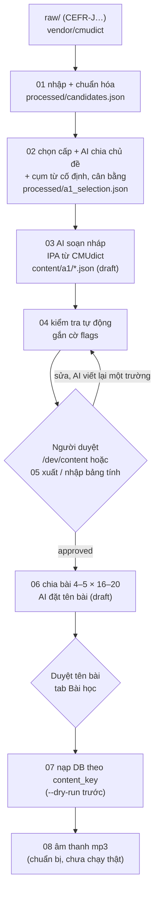

# README.md

Quy trình xây kho từ, chạy lại được nhiều lần và dùng nguyên vẹn cho A1…C2. AI chỉ soạn **bản nháp**, máy kiểm tra tự động,
người duyệt, rồi mới nạp vào DB. **Nội dung là code:** nguồn chính là `backend/content/<cấp>/<mã-chủ-đề>.json` (đưa lên Git),
và DB chỉ được nạp từ các file này.

## Chuẩn bị

- Nguồn: đặt file vào `raw/` (không đưa lên Git) và ghi đủ giấy phép ở `docs/data-sources.md`. File không có bộ đọc thì
  bước 01 dừng. Thêm nguồn mới: viết một module trong `lib/sources/` (kiểu plugin), không sửa các bước.
- AI: đặt `ANTHROPIC_API_KEY` và `ANTHROPIC_MODEL` trong `backend/.env` (không bao giờ commit, không log). Trần chi phí:
  `MAX_AI_ENTRIES_PER_RUN` (mặc định 1000 mục mỗi lần chạy). Giá ước tính đặt bằng `AI_PRICE_INPUT_PER_MTOK` /
  `AI_PRICE_OUTPUT_PER_MTOK`.
- Mọi lệnh chạy trong `backend/`, với `.venv` đã kích hoạt.

## Lệnh từng bước

| Bước | Lệnh | Ghi chú |
|---|---|---|
| 01 | `python -m data_pipeline.01_import_wordlist` | In số dòng mỗi nguồn, số trùng, số bị loại kèm lý do |
| 02 | `python -m data_pipeline.02_select_and_tag --level A1 [--limit 40] [--yes]` | Có gọi AI: in ước tính rồi hỏi xác nhận. `--limit`: chạy thử, không thêm cụm từ / cân bằng |
| 03 | `python -m data_pipeline.03_enrich_entries --level A1 [--limit 40] [--yes] [--redo-drafts]` | AI soạn theo lô 15 mục; lỗi → `processed/failed_03.json` |
| 04 | `python -m data_pipeline.04_validate --level A1` | Không gọi AI; báo cáo `processed/report_04.json` |
| duyệt | Mở `/dev/content` (backend `ENV=development`, frontend `npm run dev`) | Phím A duyệt · R từ chối (bắt buộc lý do) · S bỏ qua · J mục sau · K mục trước (quy ước Gmail / Vim); tab Bài học |
| 05 | `python -m data_pipeline.05_review_export export --level A1 --out reviewed/a1.xlsx` rồi `import --file … [--apply]` | Tùy chọn: duyệt bằng bảng tính, xem trước khác biệt trước khi ghi |
| 06 | `python -m data_pipeline.06_build_units --level A1 [--topic food] [--yes]` | Chỉ mục approved; tên bài AI đề xuất ở trạng thái draft |
| 07 | `python -m data_pipeline.07_load_to_db --level A1 --dry-run`, rồi bỏ `--dry-run` | Production: chạy `sh scripts/backup_db.sh` trước và thêm `--yes` |
| 08 | `python -m data_pipeline.08_generate_audio --level A1 --provider fake [--dry-run]` | Chưa có nhà cung cấp TTS thật |
| CI | `python -m data_pipeline.check_content` | Kiểm tra schema mọi `content/**/*.json` |

Ở dev, thay lộ trình mẫu bằng kho thật: `python -m seeds.refresh_dev_content`. Lệnh này xóa bài mẫu DEV_SAMPLE nhưng giữ
tiến độ chặng / cấp; người đang học dở được đưa về bài đầu của chặng hiện tại.

## Chạy lại an toàn

- Mọi kết quả AI được cache trong `cache/` (không đưa lên Git), theo khóa gồm headword, pos, chủ đề, phiên bản prompt và mã băm
  của prompt đã dựng. Chạy lại không gọi API lần nữa.
- Bước 03 không bao giờ ghi đè mục đã có trong file nội dung (người duyệt có thể đã sửa); nó chỉ thêm mục mới.
- **Sửa prompt hoặc hướng dẫn soạn** (`docs/content-style-guide.md`, khối `ai-rules` được chèn vào prompt): mã băm prompt đổi
  nên cache cũ không còn khớp. Sửa nhỏ thì giữ số phiên bản; đổi lớn thì tạo `prompts/<tên>_v2.md` và tăng hằng số phiên bản
  (`ENRICH_V`…). Sau đó chạy `03_enrich_entries --redo-drafts` để soạn lại các mục còn draft và chưa ai duyệt, rồi chạy lại 04.
- Bước 04 tính lại cờ từ đầu mỗi lần chạy và chỉ ghi các file thật sự đổi.
- Bước 07 upsert theo `content_key`; chạy lại không đổi gì. Mục bị bỏ khỏi file thì được đặt `retired_at`, không bị xóa: không
  dạy mới nữa, nhưng vẫn ôn được và vẫn giữ trạng thái đã thuộc.

## Cấu trúc

- `config.py`: đường dẫn, quy mô, model, 10 chủ đề mỗi cấp (khớp `seeds/seed_landmarks.py`).
- `lib/`: `sources/` (bộ đọc), `normalize.py`, `morph.py`, `ipa.py` (ARPAbet → IPA), `ai.py`, `cache.py`, `prompts.py`,
  `schemas.py`, `content.py`, `step01–03.py`, `validate.py`, `review_io.py`, `units.py`, `loader.py`, `audio.py`, `check.py`.
- `prompts/`: prompt có số phiên bản. `vendor/cmudict/`: CMUdict kèm LICENSE.
- Test: `backend/tests/pipeline/` (đơn vị, AI giả `fake_ai.py`) và `backend/tests/integration/test_content_*.py` (DB thật).
