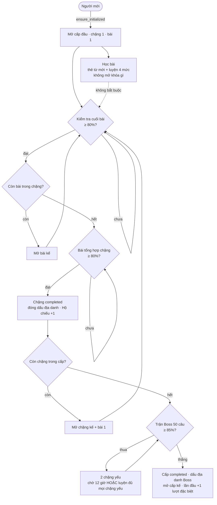

# academy.md

Lõi Học Viện (Giai đoạn 1): lộ trình thật, học bài, kiểm tra, mở khóa, Trận Boss, Cửa Ải Hôm Nay, rank + lung lay, streak, lượt quay.
Luật đã chốt tóm tắt ở `docs/game-rules.md`; mọi con số nằm trong `backend/app/core/config.py`.

## Cấu trúc

```
Level (cấp, A1, A2…) ── Topic (chặng, 1 địa danh) ── Unit (bài, 15–20 mục từ qua unit_entries)
        └── Boss (địa danh Boss lưu ở levels.boss_landmark_*)
```

Tiến độ: `user_level_progress`, `user_topic_progress`, `user_unit_progress` (trạng thái `locked → unlocked → completed`,
điểm cao nhất, số lần làm, `stamped_at`, `boss_best`, `boss_won_at`). Lần thua/thắng Boss: `boss_attempts`; luyện chặng yếu:
`topic_practice_log`. Chỉ số game: `user_stats` (rank, lung lay, streak, lượt quay, `max_spin_milestone`), sổ cấp lượt
`spin_grants` (unique `user, reason, ref`), hoạt động theo ngày `user_daily_activity`. Cửa Ải: `daily_checks`
(unique `user, local_date`). Mọi phiên học/kiểm tra/Boss/ôn dùng chung `study_sessions` (`kind`, `ref_id`, `result`).

| Lớp | File |
|---|---|
| Luật thuần (unit test, không DB) | `services/unlock.py`, `rank.py`, `streak.py`, `spins.py` |
| Lộ trình, mở khóa, Hộ chiếu | `services/roadmap_service.py` |
| Học bài, kiểm tra, bài tổng hợp, luyện chặng yếu | `services/lesson_service.py`, `session_engine.py` |
| Trận Boss | `services/boss_service.py` |
| Cửa Ải Hôm Nay | `services/daily_check_service.py` |
| Rank, streak, lượt quay | `services/stats_service.py` |
| Ôn tập, số liệu Sảnh | `services/review_service.py`, `me_service.py` |
| Chấm mọi phiên | `services/study_service.submit_answers` → `lesson_service.on_session_finished` |

## Luồng mở khóa

Mở **tuần tự** (đã chốt): bài trong chặng, chặng trong cấp. Trạng thái chỉ đi lên, không bao giờ khóa lại.



Mỗi lần nộp câu cuối, kết quả có `outcome` với `unlocked` (danh sách `{type: unit|topic_test|topic|boss|level, id, …}`) và
`stamps` (`{type: topic|boss, landmark_key, landmark_name}`) để client diễn hiệu ứng; bản đồ đọc lại `/academy/roadmap`.

## Học bài và kiểm tra

- **Học bài**: thẻ học các từ **mới** của bài, tối đa số từ mới còn lại trong ngày (`DAILY_NEW_WORDS_LIMIT` = 20, tính chung
  với Khóa học của tôi), sau đó luyện mỗi từ một câu mức 1–2 và một câu mức 3–4. Hết từ mới hoặc hết quota thì luyện lại
  từ đã gặp của bài (không có thẻ, không giới thiệu từ chưa gặp). Chưa gặp từ nào và hết quota → `NOTHING_TO_STUDY`.
- **Kiểm tra cuối bài**: `UNIT_TEST_QUESTIONS` = 20 câu (bài ít từ thì hỏi hết), xoay vòng đủ mức. Không bắt buộc học trước.
- **Bài tổng hợp chặng**: 20 câu trộn đều các bài; chỉ làm được khi mọi bài của chặng đã qua.
- Kiểm tra và Boss chỉ trả đúng/sai từng câu (để hiện thanh tiến độ, máu Boss); **đáp án đúng chỉ trả về sau khi nộp hết**.
  Riêng luyện chặng yếu lộ đáp án từng câu vì là bài luyện.

## Trận Boss

- Mở khi mọi chặng của cấp đã `completed`. `BOSS_QUESTIONS` = 50 câu, chia đều cho các chặng, mỗi mục từ tối đa một câu.
- Thắng: ≥ `BOSS_PASS_RATE` (85%). Lần **đầu** thắng mỗi cấp được +1 lượt quay đặc biệt (`spin_grants` reason `boss`, ref = mã cấp).
  Đã thắng thì đánh lại lúc nào cũng được, không thêm thưởng.
- Thua: `BOSS_WEAK_TOPICS` = 2 chặng có tỉ lệ đúng thấp nhất (hòa thì chặng đứng trước) thành chặng yếu.
- Thử lại (`can_retry`), theo lần thua gần nhất:
  - đã **hoàn thành** (trả lời hết câu) một phiên luyện cho **mỗi** chặng yếu → được thử ngay (`reason: practiced`);
  - nếu không, chờ `BOSS_RETRY_COOLDOWN_HOURS` = 12 giờ từ lúc thua (`cooldown_over`);
  - còn lại → `BOSS_COOLDOWN` (409) kèm `retry_at`, `retry_in_seconds` (tính theo giờ server) và danh sách chặng yếu.

## Cửa Ải Hôm Nay

- Ngày tính theo `users.timezone` (`utils/time.local_date`). Mỗi người một dòng `daily_checks` mỗi ngày.
- Có dưới `DAILY_CHECK_MIN_WORDS` = 2 từ **hệ thống** đã học → **miễn** (`exempt`): không chặn, streak giữ nguyên.
- Còn lại hỏi 2–5 từ hệ thống đã học (không bao giờ dùng từ tự tạo): ưu tiên từ sắp đến hạn ôn, trộn
  `DAILY_CHECK_RANDOM_WORDS` = 2 từ ngẫu nhiên. Chỉ câu mức 3 (gõ từ) và mức 4 (điền câu).
- Sai một câu → `progress_service.forget_entry`: từ thành `forgotten`, mất "đã thuộc" nếu đang thuộc
  (`mastered_count` − `DAILY_FORGET_PENALTY`), từ vào danh sách ôn gấp. Đây là **nơi duy nhất** làm mất `mastered`.
- **Chặn**: khi Cửa Ải hôm nay còn `pending`, mọi route bắt đầu phiên học (Học Viện, ôn tập, Khóa học, `/study-sessions`,
  Đấu Trường) trả `DAILY_CHECK_REQUIRED` (409). Frontend: `RouteGuards` đưa **mọi trang trong app** tới `/daily-check`;
  interceptor của `services/api.js` cũng chuyển hướng khi gặp mã này (qua nửa đêm lúc đang mở app).

## Streak

| Kết quả trong ngày | Streak |
|---|---|
| Cửa Ải đúng hết (`passed`) | +1 |
| Có câu sai (`partial`) | giữ nguyên |
| Được miễn (`exempt`) | giữ nguyên |
| Bỏ trọn một ngày | về 0 (tính lười khi đọc stats hoặc làm Cửa Ải ngày kế) |

Chạm mỗi bội số của `STREAK_SPIN_EVERY` = 7 (7, 14, 21…) → +1 lượt quay thường (reason `streak`, ref = ngày địa phương).

## Rank và lung lay

- Rank theo `users.mastered_count` (chỉ từ hệ thống): Tân Binh 0 · Đồng 100 · Bạc 300 · Vàng 600 · Bạch Kim 1.000 ·
  Kim Cương 2.000 · Cao Thủ 3.500 · Huyền Thoại 5.000 (`RANK_THRESHOLDS`).
- Đủ mốc cao hơn → lên ngay. Lần **đầu** đạt mỗi rank → +1 lượt đặc biệt (lên lại sau khi bị hạ thì không).
- Rơi dưới mốc rank hiện tại → **lung lay** `RANK_GRACE_DAYS` = 3 ngày (`shaky_deadline`); gỡ lại kịp thì hết lung lay;
  quá hạn vẫn dưới mốc → hạ xuống rank đúng theo số từ lúc đó. `/me/stats` trả `shaky_seconds_left` tính theo giờ server
  (client không tự trừ theo giờ máy).
- `stats_service.on_mastered_changed` chạy trong **cùng transaction** mỗi khi `mastered_count` đổi; dòng `user_stats` bị
  khóa `FOR UPDATE` nên hai request song song không ghi đè nhau.

## Lượt quay

| Nguồn | Loại | Ghi sổ (`reason`, `ref`) |
|---|---|---|
| Mỗi 50 từ thuộc, chỉ khi vượt `max_spin_milestone` | thường | `milestone`, mốc |
| Lần đầu lên một rank | đặc biệt | `rank_up`, mã rank |
| Lần đầu thắng Boss một cấp | đặc biệt | `boss`, mã cấp |
| Streak chạm bội số 7 | thường | `streak`, ngày |

Mất từ ở Cửa Ải rồi thuộc lại **không** cấp lượt lần nữa; tiến độ tới lượt kế (`spins.progress`) luôn tính tới mốc
`max_spin_milestone + 50`, nên `remaining` có thể lớn hơn 50. `spin_grants` có unique `(user_id, reason, ref)` và ghi bằng
`INSERT … ON CONFLICT DO NOTHING`, nên chạy lại hay gửi trùng không cấp hai lần. Logic vòng quay (gacha) chưa làm.

## Thời gian

Service luôn nhận `now` từ `core/clock.now()`, không gọi `datetime.now()`. `X-Debug-Now` (ISO 8601) ghi đè giờ cho một
request **chỉ** khi `ENV` là `development` hoặc `e2e`; production và testing bỏ qua (có test). E2E dùng header này để giả lập
nhiều ngày; route `/api/v1/dev/*` (khóa đáp án, tới thẳng Boss) cũng chỉ đăng ký ở hai môi trường đó.

## API (`/api/v1`)

| Method | Đường dẫn | Mô tả | Chặn Cửa Ải |
|---|---|---|---|
| GET | `/academy/roadmap` | Cấp → chặng → bài, trạng thái, Boss, Hộ chiếu, vị trí hiện tại | |
| GET | `/academy/units/{id}` | Nội dung một bài, số từ mới còn lại hôm nay | |
| POST | `/academy/units/{id}/learn-sessions` | Bắt đầu học bài | ✓ |
| POST | `/academy/units/{id}/test-sessions` | Kiểm tra cuối bài | ✓ |
| POST | `/academy/topics/{id}/test-sessions` | Bài tổng hợp chặng | ✓ |
| POST | `/academy/topics/{id}/practice-sessions` | Luyện chặng (yếu) | ✓ |
| GET | `/academy/levels/{id}/boss` | Trạng thái Boss, `can_retry`, lần đánh gần nhất | |
| POST | `/academy/levels/{id}/boss-sessions` | Bắt đầu Trận Boss | ✓ |
| POST | `/study-sessions/{id}/answers` | Nộp câu trả lời mọi loại phiên (idempotent); trả `results`, `summary`, `outcome`, `rewards` | ✓ |
| GET | `/daily-check/today` | Cửa Ải hôm nay (tạo nếu chưa có) | |
| POST | `/daily-check/today/answers` | Nộp câu (một hoặc nhiều) | |
| GET | `/review/due` | Số từ đến hạn, theo trạng thái, lịch 7 ngày, ôn gấp, sổ từ | |
| POST | `/review/sessions` | Bắt đầu phiên ôn | ✓ |
| GET | `/me/stats` | Số từ thuộc, rank (kèm lung lay), streak + tuần, lượt quay, hôm nay, vị trí, Hộ chiếu | |
| POST | `/dev/academy/fast-forward` | (dev/e2e) Tới thẳng Boss của một cấp | |
| GET | `/dev/study-sessions/{id}/key`, `/dev/daily-check/key` | (dev/e2e) Khóa đáp án | |

## Mã lỗi

| Mã | HTTP | Khi nào |
|---|---|---|
| `UNIT_LOCKED` | 403 | Bài chưa mở |
| `TOPIC_LOCKED` | 403 | Chặng chưa mở, hoặc bài tổng hợp khi chưa qua hết bài |
| `LEVEL_LOCKED` | 403 | Cấp chưa mở |
| `BOSS_LOCKED` | 403 | Chưa hoàn thành mọi chặng của cấp |
| `BOSS_COOLDOWN` | 409 | Thua Boss, chưa luyện đủ chặng yếu và chưa hết 12 giờ; `details` có `retry_at`, `retry_in_seconds`, `weak_topics` |
| `DAILY_CHECK_REQUIRED` | 409 | Cửa Ải hôm nay còn `pending` |
| `DAILY_CHECK_DONE` | 409 | Gửi câu mới khi Cửa Ải đã xong |
| `SESSION_FINISHED` | 409 | Gửi câu mới vào phiên đã nộp hết |
| `NOTHING_TO_STUDY` | 409 | Không còn gì để học/ôn (`details.reason`, ví dụ `daily_limit`) |

## Dữ liệu dev

`python -m seeds.seed_dev_roadmap` (trong `backend/`): A1, A2 × 10 chặng × 2 bài × 15 mục từ (~600 mục `DEV_SAMPLE`, gồm 60
mục của `seed_dev_entries`), tự nạp địa danh; từ chối chạy ở production. Xóa bằng `python -m seeds.purge_dev_entries`.
Nhánh IELTS, TOEIC, kiểm tra xếp lớp, logic vòng quay và Đấu Trường **chưa** làm trong phần này.
