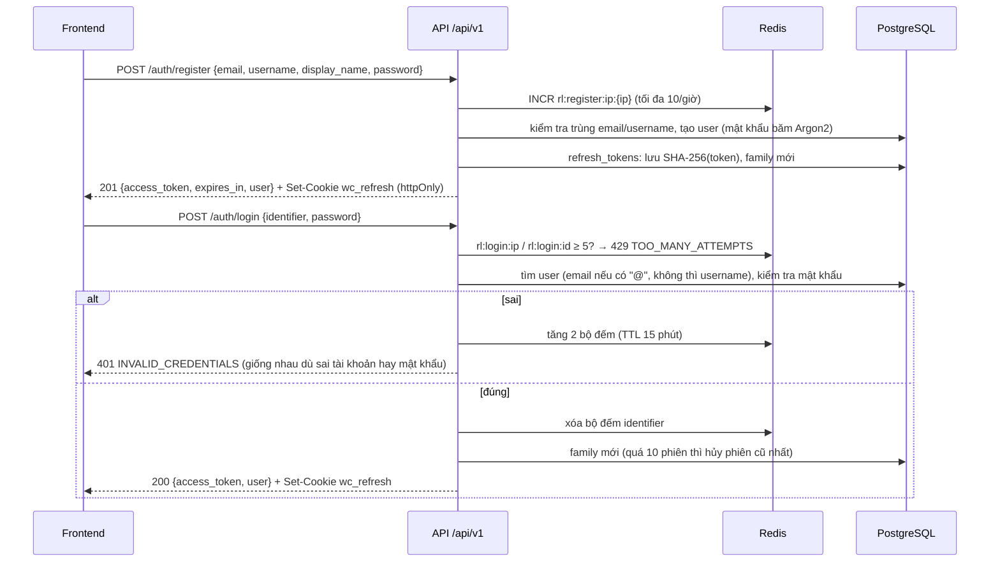
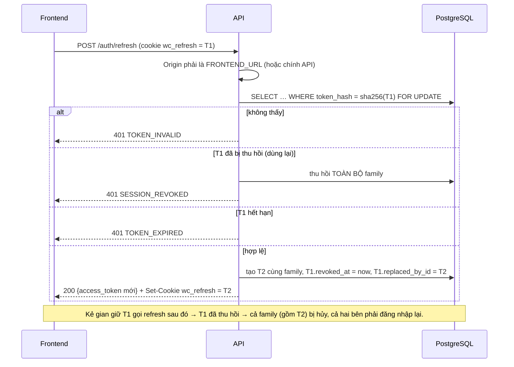

# Auth giai đoạn 1

Tài khoản, phiên đăng nhập và xác thực Socket.IO của WORDCLASH (backend FastAPI). Tài liệu API đầy đủ, có thử trực tiếp: `/docs`. Môi trường dev: `docker compose up -d` (PostgreSQL ở `localhost:5433`, database test `wordclash_test`).

**Đã chốt:**
- Đăng nhập bằng email **hoặc** username (trường `identifier`).
- Chưa bắt buộc xác thực email: dependency `require_verified_email` có sẵn nhưng chưa gắn vào route nào.
- Chưa có đăng nhập Google.
- Access token là JWT HS256, sống 15 phút, gửi qua header `Authorization: Bearer`.
- Refresh token là chuỗi ngẫu nhiên, sống 30 ngày, nằm trong cookie httpOnly. DB chỉ lưu SHA-256 của nó. Có xoay vòng và phát hiện dùng lại.
- Mật khẩu băm bằng Argon2 (pwdlib).
- ID người dùng là UUID.

**Chưa làm:** gửi email, quên mật khẩu, Google, xóa tài khoản.

## Luồng

### Đăng ký và đăng nhập



### Làm mới phiên (xoay vòng) và phát hiện dùng lại



## Endpoint

| Phương thức | Đường dẫn | Cần đăng nhập | Mô tả | Lỗi có thể gặp |
|---|---|---|---|---|
| GET | `/api/v1/health` | – | Trạng thái server, DB, Redis | – |
| POST | `/api/v1/auth/register` | – | Đăng ký → 201 `TokenOut` + cookie | EMAIL_TAKEN, USERNAME_TAKEN, VALIDATION_ERROR, TOO_MANY_ATTEMPTS |
| POST | `/api/v1/auth/login` | – | Đăng nhập bằng `identifier` → `TokenOut` + cookie | INVALID_CREDENTIALS, ACCOUNT_DISABLED, TOO_MANY_ATTEMPTS |
| POST | `/api/v1/auth/token` | – | Form OAuth2 (`username` = email hoặc username), chỉ cho nút Authorize trên /docs → `{access_token, token_type}`, không tạo phiên | INVALID_CREDENTIALS, ACCOUNT_DISABLED, TOO_MANY_ATTEMPTS |
| POST | `/api/v1/auth/refresh` | cookie | Xoay vòng refresh token → `TokenOut` + cookie mới | TOKEN_INVALID, TOKEN_EXPIRED, SESSION_REVOKED, ACCOUNT_DISABLED, FORBIDDEN_ORIGIN |
| POST | `/api/v1/auth/logout` | cookie | Hủy phiên hiện tại, xóa cookie → 204 (kể cả cookie không hợp lệ) | FORBIDDEN_ORIGIN |
| POST | `/api/v1/auth/logout-all` | Bearer | Hủy mọi phiên, xóa cookie → 204 | TOKEN_*, FORBIDDEN_ORIGIN |
| POST | `/api/v1/auth/change-password` | Bearer (+ cookie) | Đổi mật khẩu, hủy phiên khác, giữ phiên của cookie → `TokenOut` | WRONG_PASSWORD, WEAK_PASSWORD, VALIDATION_ERROR |
| GET | `/api/v1/users/me` | Bearer | `UserOut` | TOKEN_INVALID, TOKEN_EXPIRED, ACCOUNT_DISABLED |
| PATCH | `/api/v1/users/me` | Bearer | Sửa `display_name`, `timezone`, `avatar_mascot_id` (chỉ trường được gửi) | VALIDATION_ERROR |
| PATCH | `/api/v1/users/me/onboarding` | Bearer | `{goal, daily_minutes, starter_mascot_id, start_mode}` → `{user, next_step}` | VALIDATION_ERROR |

**Dữ liệu chính:**
- **`TokenOut`:** `{access_token, token_type: "bearer", expires_in: 900, user: UserOut}`.
- **`UserOut`:** `{id (UUID), email, username, display_name, timezone, avatar_mascot_id, goal, daily_minutes, onboarding_completed, email_verified, role, created_at}`. Không bao giờ có `password_hash`.
- **Đăng ký:** `email`; `username` 3–20 ký tự `[a-z0-9._]` (tự chuyển chữ thường, không bắt đầu/kết thúc bằng dấu chấm); `display_name` 1–30 ký tự; `password` 8–128 ký tự, không trùng email, username hay phần trước @; `timezone` tùy chọn (mặc định `Asia/Ho_Chi_Minh`).
- **Onboarding:**
  - `goal`: `general | ielts | toeic`;
  - `daily_minutes`: `5 | 10 | 15 | 20`;
  - `starter_mascot_id`: `1 | 2 | 3`;
  - `start_mode`: `a1 | placement`.
  - `next_step` trả về `roadmap_a1 | placement_test`.

## Mã lỗi

Mọi lỗi có dạng `{"error": {"code": "...", "message": "...", "details": ...}}`. `message` là tiếng Việt, hiển thị thẳng cho người dùng được.

| Mã | HTTP | Thông báo | Ghi chú |
|---|---|---|---|
| VALIDATION_ERROR | 422 | Dữ liệu chưa hợp lệ, bạn kiểm tra lại nhé. | `details`: `[{field, message}]` |
| EMAIL_TAKEN | 409 | Email này đã được dùng | `details.field = "email"` |
| USERNAME_TAKEN | 409 | Tên người dùng đã có người chọn | `details.field = "username"` |
| INVALID_CREDENTIALS | 401 | Thông tin đăng nhập không đúng | |
| TOO_MANY_ATTEMPTS | 429 | Bạn thử quá nhiều lần… | `details.retry_after_seconds`, header `Retry-After` |
| TOKEN_EXPIRED | 401 | Phiên đăng nhập đã hết hạn. | access hoặc refresh token hết hạn |
| TOKEN_INVALID | 401 | Phiên đăng nhập không hợp lệ… | thiếu, sai chữ ký, sai loại, user không tồn tại |
| SESSION_REVOKED | 401 | Phiên đăng nhập đã bị thu hồi… | refresh token bị dùng lại hoặc phiên đã đăng xuất |
| WEAK_PASSWORD | 422 | Mật khẩu này quá dễ đoán… | đổi mật khẩu: trùng email/username hoặc trùng mật khẩu cũ |
| WRONG_PASSWORD | 400 | Mật khẩu hiện tại không đúng | |
| ACCOUNT_DISABLED | 403 | Tài khoản này đã bị khóa. | |
| FORBIDDEN_ORIGIN | 403 | Yêu cầu bị từ chối… | Origin khác FRONTEND_URL ở refresh/logout/logout-all |
| FORBIDDEN | 403 | Bạn không có quyền… | route chỉ dành cho admin |
| EMAIL_NOT_VERIFIED | 403 | Bạn cần xác thực email trước. | dành cho giai đoạn 2 |
| NOT_FOUND / METHOD_NOT_ALLOWED / INTERNAL_ERROR | 404 / 405 / 500 | | lỗi chung |

## Cookie refresh token

| Thuộc tính | Giá trị |
|---|---|
| Tên | `wc_refresh` (`COOKIE_NAME`) |
| HttpOnly | luôn bật (JavaScript không đọc được) |
| Secure | `COOKIE_SECURE`; để trống thì tự bật khi `ENV=production` |
| SameSite | `Lax` |
| Path | `/api/v1/auth` (`COOKIE_PATH`): trình duyệt chỉ gửi kèm các route auth |
| Domain | `COOKIE_DOMAIN` (để trống = đúng host của API) |
| Max-Age | 30 ngày (`REFRESH_TOKEN_EXPIRE_DAYS`) |

Chống CSRF: các route dùng cookie (refresh, logout, logout-all) từ chối mọi header `Origin` không phải `FRONTEND_URL` (hoặc chính địa chỉ API, để /docs dùng được). Khi dev, frontend gọi qua proxy của Vite (`/api` → cổng 8000) nên trình duyệt coi là cùng site; khi triển khai khác domain thì phải cấu hình `COOKIE_DOMAIN` và `FRONTEND_URL` cho khớp.

## Giới hạn và an toàn

- **Đăng nhập sai:** mỗi lần tăng `rl:login:ip:{ip}` và `rl:login:id:{identifier}` (TTL 15 phút). Một trong hai bộ đếm ≥ 5 thì trả 429, **kể cả khi mật khẩu đúng**. Đăng nhập đúng thì xóa bộ đếm của identifier.
- **Đăng ký:** tối đa 10 lần/IP/giờ.
- **Khi Redis không chạy:** bỏ qua giới hạn và ghi cảnh báo, không chặn đăng nhập.
- **Chống dò tài khoản:** sai tài khoản hay sai mật khẩu đều trả cùng một lỗi. Không có user thì vẫn kiểm tra trên hash giả để thời gian phản hồi như nhau.
- **Giới hạn phiên:** tối đa 10 phiên (family) đang hoạt động mỗi người; vượt thì hủy phiên bắt đầu sớm nhất.
- **Đổi mật khẩu:** hủy mọi phiên khác. Access token cũ của thiết bị khác còn dùng được tối đa 15 phút.
- **IP:** lấy từ `request.client.host`; chỉ đọc `X-Forwarded-For` khi `TRUST_PROXY=true`.
- **Log:** không ghi mật khẩu, token hay body request. Engine SQL đặt `hide_parameters`.
- **Dọn dẹp:** `auth_service.cleanup_expired_tokens` xóa token hết hạn quá 7 ngày, chạy định kỳ khi có scheduler.

## Socket.IO

Client gửi access token khi kết nối. Token thiếu, sai hoặc hết hạn thì server từ chối: `connect_error` có `err.message` là `TOKEN_INVALID` hoặc `TOKEN_EXPIRED`, `err.data` là `{code, message}`. Kết nối được thì socket vào room `user:{id}`. Sự kiện `whoami` trả `{user_id}`.

## Hướng dẫn tích hợp frontend

1. **Giữ access token trong bộ nhớ** (Zustand, `authStore`). **Không** lưu vào localStorage hay sessionStorage. Refresh token nằm trong cookie httpOnly, JavaScript không đọc và cũng không cần đọc.
2. **Axios** dùng `baseURL: '/api/v1'`, `withCredentials: true`. Interceptor request gắn `Authorization: Bearer <accessToken>` khi có.
3. **Interceptor response:** gặp 401 có `error.code === 'TOKEN_EXPIRED'` thì gọi `/auth/refresh` **đúng một lần** cho mọi request đang lỗi, rồi gửi lại các request đó. Các mã 401 khác (SESSION_REVOKED, TOKEN_INVALID…) thì xóa store và chuyển tới trang đăng nhập.

   ```js
   let refreshing = null // Promise dùng chung: mọi request 401 cùng lúc chờ một lần refresh
   api.interceptors.response.use(undefined, async (error) => {
     const { config, response } = error
     if (response?.status !== 401 || response.data?.error?.code !== 'TOKEN_EXPIRED' || config._retried) throw error
     refreshing ??= api.post('/auth/refresh').then((r) => r.data).finally(() => { refreshing = null })
     try {
       const { access_token, user } = await refreshing
       useAuthStore.getState().setSession(access_token, user)
     } catch (e) {
       useAuthStore.getState().clear()
       throw e
     }
     config._retried = true
     config.headers.Authorization = `Bearer ${useAuthStore.getState().accessToken}`
     return api(config)
   })
   ```
4. **Khi tải trang:** gọi `POST /auth/refresh` để khôi phục phiên từ cookie. Thành công thì lưu access token và user; nhận 401 thì coi như chưa đăng nhập.
5. **Đăng xuất:** gọi `POST /auth/logout`, rồi xóa store.
6. **Socket:** `io({ auth: { token: accessToken } })`. Gặp `connect_error` với `err.message === 'TOKEN_EXPIRED'` thì refresh, cập nhật `socket.auth.token`, rồi `socket.connect()` lại.
7. **Form:**
   - Đăng ký gửi `display_name` (form hiện đặt tên `displayName`), có thêm ô `username`.
   - Đăng nhập gửi `identifier` (email hoặc username).
   - Lỗi 422 hiển thị theo `error.details[i].field`. Lỗi 409 có `details.field` để tô đỏ đúng ô.
8. **Onboarding:** gọi `PATCH /users/me/onboarding`, rồi điều hướng theo `next_step` (`roadmap_a1` → `/travel?variant=start` hoặc bản đồ A1; `placement_test` → `/academy/placement`).
