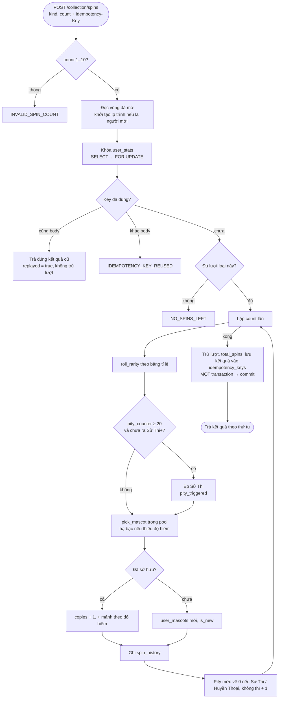

# collection.md

Bộ Sưu Tập và vòng quay linh vật: danh mục 100 ô, sở hữu, quay thẻ, mảnh, đổi mảnh, avatar và linh vật Đấu Trường.
Luật đã chốt ở `docs/game-rules.md`; hằng số trong `backend/app/core/config.py` (`GACHA_*`, `PITY_EPIC`, `MASCOT_DISTRIBUTION`,
`SPIN_RATE_LIMIT_PER_MINUTE`, `IDEMPOTENCY_TTL_HOURS`).

**Mọi kết quả quay do server quyết định** bằng `secrets.SystemRandom()`. Client chỉ gửi loại lượt và số lượt, rồi diễn hoạt
cảnh theo kết quả nhận được. Linh vật chỉ để trang trí, không có chỉ số sức mạnh. Không có cách nào mua lượt quay hay mảnh.

## Dữ liệu

| Nguồn / bảng | Nội dung |
|---|---|
| `backend/seeds/data/mascots.json` | NGUỒN CHÍNH của 100 ô: id, code, tên, độ hiếm, vùng, status, obtain, is_starter, hình khối, màu, phụ kiện |
| `docs/mascots-lore.md` | Hồ sơ (ngày sinh, quê, tính cách, thích, ghét, từ yêu thích, câu cửa miệng, tiểu sử), ghép khi seed |
| `mascots` | Danh mục trong DB (`python -m seeds.seed_mascots`, chạy lại an toàn, không đổi id) |
| `user_mascots` | Sở hữu: `copies` ≥ 1, `source` (starter, gacha, exchange, achievement) của bản đầu, `is_new` |
| `user_stats` | `spins_normal`, `spins_special`, `shards`, `pity_counter`, `total_spins` |
| `spin_history` | Mỗi lượt một dòng: `batch_id`, `rolled_rarity`, `final_rarity`, `rarity_fallback`, `pity_triggered`, trùng / mảnh, pity trước / sau |
| `shard_exchanges` | Lịch sử đổi mảnh |
| `idempotency_keys` | Kết quả theo (user, key, endpoint) + `request_hash` của body; dọn bản ghi cũ hơn 24 giờ |
| `users.avatar_mascot_id`, `users.arena_mascot_id` | Khóa ngoại tới `mascots`; `arena_mascot_id = null` thì Đấu Trường dùng avatar |

- Ba linh vật khởi đầu (#001 Bông Tím, #002 Bé Thính, #003 Ớt Hiểm) lưu `obtain = gacha` + `is_starter = true`. Chúng vẫn nằm
  trong vòng quay như mọi linh vật gacha; cờ chỉ đánh dấu được chọn ở onboarding. Bé Thính và Ớt Hiểm thuộc vùng A2.
- Seed kiểm tra: phân bổ vùng × độ hiếm khớp `MASCOT_DISTRIBUTION` (tổng 45 / 30 / 18 / 7), id 1–100 không trùng, ô
  `coming_soon` không có tên, linh vật Đặc biệt (và chỉ chúng) là `achievement`; lore sai tên, khóa lạ hoặc mã lạ thì báo lỗi.
- Migration `29ca2fa1d9e0` ghi sẵn 100 dòng gốc (để khóa ngoại và bước bù sở hữu chạy được), rồi tạo `user_mascots`
  (source = starter) cho người dùng cũ có `avatar_mascot_id` ∈ {1, 2, 3}.
- Frontend: `data/mascots.js` chỉ là bản mock (VITE_USE_MOCK); `tests/mascotsCatalog.test.js` bắt lệch so với JSON. Chế độ
  thường đọc `GET /mascots` (có ETag) qua `store/mascotStore.js`.

## Luồng quay

Màn quay nhận đủ kết quả (đã commit) rồi mới bắt đầu hiệu ứng. Tải lại trang giữa chừng không mất thẻ, vì thẻ đã nằm trong album.

## Tỉ lệ, pool, pity, hạ bậc

| Độ hiếm | Lượt thường | Lượt đặc biệt | Mảnh khi trùng | Giá đổi |
|---|---|---|---|---|
| Thường | 60% | 0% | +2 | 20 |
| Hiếm | 28% | 70% | +4 | 40 |
| Sử Thi | 10% | 24% | +8 | 60 |
| Huyền Thoại | 2% | 6% | +20 | 150 |

- **Lượt đặc biệt**: lần đầu lên mỗi rank, lần đầu thắng Boss mỗi cấp. **Lượt thường**: mỗi 50 từ thuộc (vượt mốc cao nhất), streak bội số 7.
- **Pool**: linh vật `released`, `obtain = gacha`, thuộc vùng đã mở (cấp có `user_level_progress` unlocked hoặc completed). Cùng
  độ hiếm thì ngang xác suất. Ô `coming_soon` và linh vật `achievement` không bao giờ quay ra.
- **Pity**: `pity_counter` đếm số lượt liên tiếp chưa ra Sử Thi trở lên, tính chung cả lượt thường và đặc biệt. Đạt 20 thì
  lượt kế chắc chắn Sử Thi; nếu tỉ lệ gốc đã ra Huyền Thoại thì giữ Huyền Thoại. Ra Sử Thi hoặc Huyền Thoại thì về 0.
  Bộ đếm tính theo độ hiếm **thực nhận** (sau hạ bậc).
- **Hạ bậc** (`rarity_fallback`): độ hiếm rơi trúng mà pool không có con nào thì thử lần lượt các độ hiếm thấp hơn tới
  Thường; vẫn trống thì thử lần lượt các độ hiếm cao hơn.
- Kiểm định (`tests/unit/test_gacha.py`): 200.000 lượt với seed cố định, mỗi độ hiếm nằm trong ±0,5 điểm % (lượt thường
  60,04 / 27,94 / 10,05 / 1,97; lượt đặc biệt 0 / 69,98 / 24,05 / 5,96); chi-square giữa các con cùng độ hiếm.

## Đổi mảnh

Chỉ đổi được linh vật **chưa sở hữu**, `released`, `obtain = gacha`, thuộc vùng đã mở. Đủ mảnh thì trừ mảnh, tạo
`user_mascots` (source = exchange, is_new) và ghi `shard_exchanges`. Cũng bắt buộc Idempotency-Key, cũng khóa `user_stats`.

## Idempotency và tranh chấp

- `POST /collection/spins` và `POST /collection/exchange` bắt buộc header `Idempotency-Key` (UUID). Frontend
  (`services/collectionApi.js`) sinh key mới cho mỗi lần bấm. Gặp lỗi mạng thì tự thử lại một lần với **cùng** key; người
  dùng bấm lại sau lỗi mạng cũng dùng lại key đó. Nút MỞ THẺ bị khóa ngay khi bấm (ref), nên bấm đôi chỉ gửi một yêu cầu.
- Server khóa dòng `user_stats` rồi mới tra key. Hai request song song của cùng một người (kể cả cùng key) chạy lần lượt:
  còn 1 lượt mà 2 request cùng lúc thì chỉ 1 thành công (có test với kết nối riêng và commit thật).
- **Thứ tự khóa toàn backend**: khởi tạo lộ trình (khóa advisory trong `roadmap_service.ensure_initialized`) → `users` →
  `user_stats`. Mọi hàm đọc vùng đã mở (có thể khởi tạo lộ trình) đều chạy TRƯỚC khi khóa `user_stats`.
- Giới hạn tần suất: `POST /collection/spins` tối đa 30 request mỗi phút mỗi người (Redis, dự phòng trong bộ nhớ) →
  `TOO_MANY_ATTEMPTS` kèm `Retry-After`.

## API (`/api/v1`, cần đăng nhập)

| Method | Đường dẫn | Mô tả |
|---|---|---|
| GET | `/mascots` | 100 ô; header `ETag`, gửi `If-None-Match` trùng thì nhận 304. Ô coming_soon chỉ có id, code, region, rarity, status |
| GET | `/mascots/{id}` | Chi tiết (kèm `profile`); ô coming_soon tối thiểu |
| GET | `/collection` | Sở hữu, tiến độ theo độ hiếm và vùng, vùng đã mở, mảnh, pity, lượt, tiến độ tới lượt kế, avatar, linh vật Đấu Trường, số thẻ mới |
| GET | `/collection/rates` | Tỉ lệ hai loại lượt, `pity_epic`, `pity_counter`, `pool_size` theo độ hiếm, bảng mảnh, giá đổi, `max_batch` |
| POST | `/collection/spins` | `{kind: normal \| special, count: 1..10}` + `Idempotency-Key`; trả `results` theo thứ tự (mascot, `rarity`, `hint` cho màu ánh sáng, `is_new_mascot`, `was_duplicate`, `shards_gained`, `copies`, `pity_triggered`, `rarity_fallback`), lượt còn lại, mảnh, pity, `replayed` |
| POST | `/collection/exchange` | `{mascot_id}` + `Idempotency-Key` |
| POST | `/collection/seen` | `{mascot_ids}`: tắt nhãn MỚI |
| PATCH | `/users/me` | `avatar_mascot_id`, `arena_mascot_id` (null = dùng avatar); cả hai kiểm tra sở hữu |
| PATCH | `/users/me/onboarding` | `starter_mascot_id` ∈ {1, 2, 3}: sở hữu ngay (source = starter) rồi đặt làm avatar |
| POST | `/dev/grant-spins` | (chỉ dev/e2e) `{normal, special}` |
| POST | `/dev/set-pity` | (chỉ dev/e2e) `{value}` |
| POST | `/dev/force-next` | (chỉ dev/e2e) `{rarity, mascot_id?}`: ép ĐÚNG lượt kế tiếp (lưu trong bộ nhớ tiến trình) |

Route `/dev/*` chỉ được đăng ký khi `ENV` là development hoặc e2e; có test xác nhận ở production và testing chúng không tồn tại.

## Mã lỗi

| Mã | HTTP | Khi nào |
|---|---|---|
| `MASCOT_NOT_FOUND` | 404 | id không có trong danh mục |
| `NO_SPINS_LEFT` | 409 | Không đủ lượt loại đã chọn (`details`: kind, available, requested) |
| `INVALID_SPIN_COUNT` | 422 | count ngoài 1–10 |
| `NOT_ENOUGH_SHARDS` | 409 | Chưa đủ mảnh (`details`: shards, cost) |
| `MASCOT_ALREADY_OWNED` | 409 | Đổi mảnh lấy linh vật đã có |
| `MASCOT_NOT_EXCHANGEABLE` | 409 | coming_soon, achievement hoặc vùng chưa mở |
| `MASCOT_NOT_OWNED` | 403 | Đặt avatar / linh vật Đấu Trường mà chưa sở hữu (`details.field`) |
| `IDEMPOTENCY_KEY_REQUIRED` | 400 | Thiếu hoặc sai định dạng (không phải UUID) header `Idempotency-Key` |
| `IDEMPOTENCY_KEY_REUSED` | 409 | Cùng key nhưng body khác |
| `TOO_MANY_ATTEMPTS` | 429 | Quá 30 request quay mỗi phút |

## Frontend

- `services/collectionApi.js` (thật / mock cùng dạng dữ liệu), `store/mascotStore.js` (danh mục, `useMascot`),
  `store/collectionStore.js` (chấm đỏ ở mục Bộ Sưu Tập khi còn lượt hoặc có thẻ MỚI).
- Màn: `/collection` (album, lọc độ hiếm / vùng, "Chỉ hiện đã có", sắp xếp, nhãn "Sắp ra mắt" / "Mở khóa ở B1"; mở album
  thì gọi `/collection/seen`), chi tiết (hồ sơ, 4 tư thế bằng `components/collection/ShapeMascot.jsx`, "Đang dùng ✓"),
  đổi mảnh, `/collection/spin` (hiệu ứng theo độ hiếm, mở tất cả ≤ 10, bỏ qua hiệu ứng, giảm chuyển động).
- Sảnh: viên lượt quay mở màn quay; "Linh vật đang dùng" lấy avatar thật, nút ĐỔI mở bộ chọn linh vật đang sở hữu.
  Học Viện: toast phần thưởng có nút "Quay ngay".
- Ảnh chụp: `npm run screenshots -- -g "Bộ Sưu Tập"` (`scripts/screenshots/collection.shots.js`).
